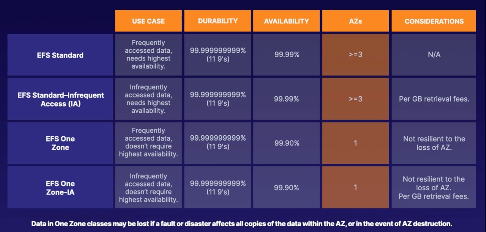

# EFS integration with Lambda and SQS:

## Virtual Private Cloud - [VPC](https://docs.aws.amazon.com/vpc/latest/userguide/working-with-vpcs.html):
### VPC and Basic Network Design:
A VPC lets you provision a logically-isolated section of the AWS Cloud. You can launch different resources in a virtual
network that you define.

You have complete control over your virtual networking environment, selection of IP address range, creation of subnets,
amd configuration of routing tables and network gateways.

You can have multiple VPCs per account and per region - you can have up to 5 VPCs/Region.

### Classless Inter-Domain Routing - CIDR:
Number of IPv4 address: 2^(32 - slashSubnetting).


### Subnets, VPC Route Tables, and Route Tables:

#### Subnet:
Separate a specific CIDR range within an AZ.
A Segment of a VPC that lives entirely within a single AZ. Subnets cannot span more than one AZ. Subnets can be public,
private, or VPC only.

IPv4 Addressing is required for all VPCs, but IPv6 is optional.

Choosing a Private Addressing Space:
* 192.168.0.0 - 192.168.255.255 (offers   1 / 16 range)
* 172.16.0.0  - 172.31.0.0      (offers  16 / 16 range)
* 10.0.0.0.   - 10.255.255.255  (offers 256 / 16 range )

for more information about address allocation for Private Internets check the [RFC 1918](http://www.faqs.org/rfcs/rfc1918.html).

Choosing VPC CIDR Block:
1. Integration with other VPCs.
2. Integration with on-premise networks.
3. Plans for subnetting.

```
Note: Avoid using the default VPC if your VPC will communicate with other VPCs.
default VPC: 132.31.0.0/16
```

### VPC Router - Also known as the implicit router:
A logical construct where all routing decisions begin. Routing decisions are governed by route tables associated with VPCs
and subnets. This is the first place packets hit when leaving resources that are in a VPC/subnet.

``` AWS Reserved IP Addresses:
For Example, subnet with CIDR range of 10.0.64.0./21, the following ip addresses are reserved:
* 10.0.64.0: Network Address.
* 10.0.64.1: Reserved by AWS for the VPC router.
* 10.0.64.2: Reserved by AWS for the DNS server.
* 10.0.71.255: Network bradcast address.
```

Best Practice: Create custom Route table per Subnet.

1. Highly Available device.
2. Communication Between VPC Subnets: By default, it allows communication between subnets in the same VPC.
   This is what the static "local" route table entry defines.
3. Influencing VPC Routing: You can influence the routing for your VPC by editing the main route table or creating custom
   route tables for each of your subnets.

### Elastic Network Interfaces, Elastic IPs, and Internet Gateways
#### Elastic Network Interface - ENI:
A virtual network interface that you can attach to an instance in a VPC. Upon creation, 
ENIs are inside a VPC and are associated with s subnet.

ENI are AZ scoped, you cannot move an ENI from one AZ to another. Also you cannot add more ENIs to an EC2 instance to improve bandwidth
to or from that instance.

#### Internet Gateway:
A highly scalable VPC component that allows communication between instances in your VPC and the internet. When an instance receives traffic
from the internet, the IGW translate the destination address to the instances private address and forwards the traffic to the VPC.
-> translate private IPs to associated public IP addresses.

The internet gateway can be associated with only one VPC,a dn can be created within only one Region.


#### Elastic IP:
A static, public IPv4 address that you can allocate to your account - taken from the pool - and release from your account - returned from the pool.
The address comes from a pool of regional IPv4 addresses that AWS manages.
-> Keep you static IP even when the underlying infrastructure changes.


#### Network Access List Control - NACL - and Security Groups - SG:
##### Network Access List Control - stateless:
NACLs are applied to any resource launched into a subnet.

#### Security Groups - stateful:
SGs only apply to those ENIs or resource they are associated with. 


## Elastic File System:
### EFS introduction:
* Managed Network File System: Highly Available
* Standard NFS protocol: USed by Linux Systems. EFS is for Linux-based workloads only.
* Multiple EC2 instances can access -  you cannot share EBS with multiple services...
* Lifecycle Management: any files in your file system that are not accessed for a period of time will automatically move
  to the EFS infrequent Access - EFS IA - storage class.
* Encryption: You can configure encryption at rest(only while creating it) and in transit.

### EFS Storage Classes:


### 