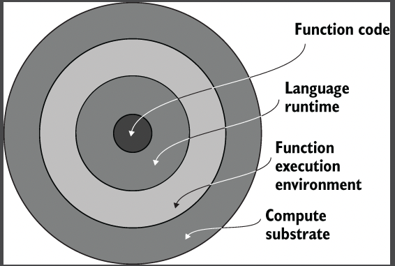
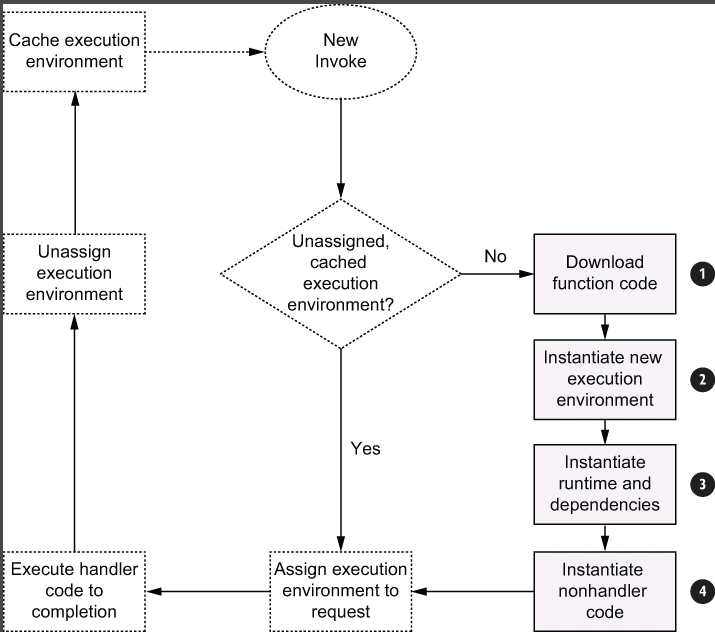

## Lambda Performance:

### AWS Lambda Lifecycle:

When you invoke AWS lambda function, there different layers in play - the Lambda compute substrate, the execution
environment, and the function code.

When the first request or event arrives for your lambda function, the AWS Lambda service performs
a series of steps. Once the environment exists, Lambda runs the code inside your function handler.

1. Downloads your lambda function code onto the part of the compute substrate where your code will run.
2. Instantiate a new execution environment with the Programming Language Runtime.
3. Instantiate your non-function dependencies.
4. Runs the parts of your function written outside the handler.

When the request is completed, AWS lambda does not discard the execution environment. Instead,
it caches the execution environment, where all processes inside the execution environment are paused.

When a subsequent request arrives during this time and a cached execution environment is available,
AWS lambda will reuse the execution environment to service the request.

### Latency: Cold vs Warm

The latency incurred due to step 1 through step 4 is referred to commonly as the <mark>Cold start penalty</mark>.

We refer to the request latency for a request incurring a cold start as cold latency, and we refer
to the actual function execution latency as <mark>Warm latency</mark>.

Requests that experience cold starts may also experience timeouts because the AWS Lambda timeout setting
is applied to the total request latency.

### Optimizing latency:

1. Minimize deployment artifact size: The size of your deployment package directly impacts your cold start penalty
   in two ways.
2. Allocate sufficient resources to your execution environment: Your code requires compute resources (CPU, Memory)
   to run. AWS Lambda provides a single dial to set the resources required by your function: the memory setting.
   Also, AWS Lambda allocates CPU power proportional to memory.
3. Optimizing function logic: 
    * Minimize Orchestration in code.
    * USe Thread for I/O intensive operations

## Concurrency:
   

## Lambda Monitoring

### CloudWatch Metrics:
Each serverless service (like AWS Lambda, API Gateway) emits standard metrics that help you understand
the performance and availability characteristics, For Lambda, AWS offers the following metrics among others:

* Invocations: Total number of requests received by the given function. This inclusive of all requests.
* Duration: Measures the elapsed wall clock time from when the function code starts executing to when
  it stops executing.
* Errors: Measures the number of invocations that failed due to errors in the function.
* Throttles: Measures the number of invocations that did not result in your function code executing because
  your function hit either its concurrency limit or caused the account to his its concurrency limit (1000 concurrent 
  executions is the default limit but can be raised by contacting AWS).

### AWS X-Ray:
AWS X-Ray is a series that allows you to detect, analyze and optimize performance issues with your AWS Lambda function
and trace requests across multiple services within your serverless architecture.